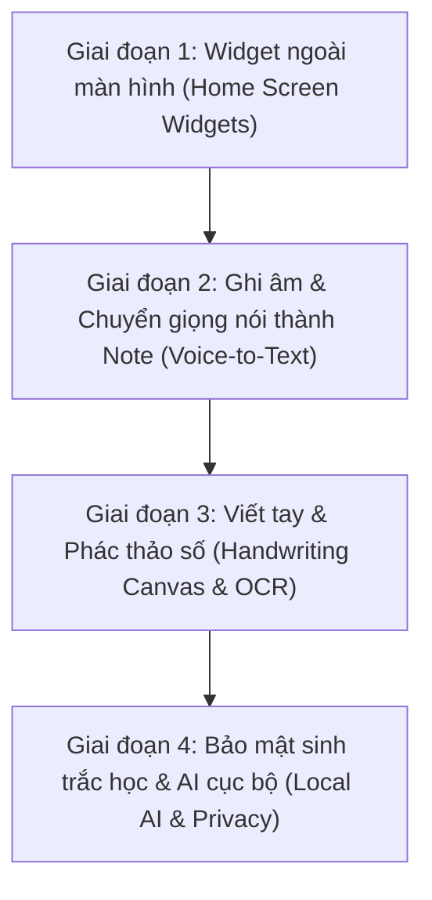

# Lộ Trình Phát Triển Sản Phẩm (Product & Feature Roadmap)

Tài liệu này định hình tầm nhìn dài hạn, phân tích đối chuẩn cạnh tranh và lộ trình phát triển tính năng cho **Clean Notes** (`flutter-clean-notes`).

---

## 1. Tầm nhìn Sản phẩm & Giá trị Cốt lõi (Product Vision)

**Clean Notes** được định vị là:
> **Ứng dụng ghi chú Local-First, Thiết kế Aurora Glass hiện đại nhất, Tốc độ chớp nhoáng và Bảo mật riêng tư tuyệt đối.**

### 4 Trụ cột cốt lõi
1. **Local-First & Quyền riêng tư (True Privacy)**:
   - Dữ liệu thuộc về người dùng 100%, lưu trữ bằng SQLite cục bộ (Schema v7).
   - Không bắt buộc tài khoản đám mây, không quảng cáo, không theo dõi hành vi (telemetry/tracking).
   - Các tính năng AI (chuyển giọng nói, nhận diện chữ viết tay) được ưu tiên xử lý trực tiếp trên thiết bị (**On-Device AI/ML**).
2. **Không khóa chặt dữ liệu (Zero Vendor Lock-in)**:
   - Dễ dàng xuất/nhập toàn bộ dữ liệu dưới dạng chuẩn mở: Markdown (`.md`), Plain Text (`.txt`), và JSON sao lưu đầy đủ.
3. **Hiệu năng & Tốc độ chớp mắt (< 1 giây)**:
   - Khởi động tức thì, thao tác mượt mà 60–120 FPS.
   - Cho phép người dùng ghi lại ý tưởng chỉ sau 1 chạm từ màn hình chính điện thoại (Home Screen).
4. **Ngôn ngữ thiết kế Aurora Glass độc bản**:
   - Giao diện kính mờ (Glassmorphism), hiệu ứng chuyển sáng tinh tế, tôn trọng công thái học (ergonomics) cho thiết bị di động, máy tính bảng và màn hình lớn.

---

## 2. Phân Tích Đối Chuẩn Cạnh Tranh (Competitive Benchmark)

| Ứng dụng | Điểm mạnh nhất | Điểm yếu / Thiếu sót | Chiến lược của Clean Notes để vượt trội |
| :--- | :--- | :--- | :--- |
| **Google Keep** | Rất nhẹ, widget ngoài màn hình tốt, tạo note nhanh. | Không hỗ trợ Markdown, định dạng nghèo nàn, gắn chặt vào Google Cloud, thiếu tổ chức phân cấp. | **Giữ sự nhanh gọn của Keep**, nhưng bổ sung **Markdown đầy đủ**, tổ chức thẻ mạnh mẽ, và **hoàn toàn riêng tư offline**. |
| **Apple Notes** | Trải nghiệm bút Apple Pencil tuyệt vời, scan tài liệu mượt, tích hợp sâu vào iOS. | Chỉ chạy trên hệ sinh thái Apple, khó xuất dữ liệu sang nền tảng khác, giao diện theo phong cách phẳng cũ. | **Đa nền tảng** (Android, iOS, Web, Windows), xuất file mở, giao diện **Aurora Glass đẳng cấp**. |
| **Notion** | Quản lý khối (block-based) đa năng, liên kết cơ sở dữ liệu. | Quá nặng nề, khởi động lâu, offline cực tệ, không phù hợp để ghi chú tức thời khi đang di chuyển. | **Khởi động dưới 1 giây**, hoạt động offline 100% bằng SQLite, tập trung tối đa vào tốc độ ghi chú. |
| **Samsung Notes** | Nhận diện chữ S-Pen cực tốt, tính năng **Audio Bookmark** (nghe lại âm thanh đồng bộ chữ viết). | Chỉ dùng được trên thiết bị Samsung, không có cho các dòng máy Android khác hoặc iOS. | Mang trải nghiệm viết tay thông minh và ghi âm chất lượng cao lên **mọi dòng máy Android và iOS**. |
| **Obsidian** | Dữ liệu lưu tại máy (Local-first), Markdown chuẩn, hệ sinh thái plugin đồ sộ. | Trải nghiệm trên mobile cồng kềnh, khó dùng cho người phổ thông, không có công cụ vẽ tay native mượt. | **Trải nghiệm di động tối ưu**, giao diện cảm ứng tự nhiên, tích hợp sẵn Audio & Bút vẽ ngay trên mobile. |

---

## 3. Lộ Trình Triển Khai Tính Năng (Phase-by-Phase Roadmap)

---

### GIAI ĐOẠN 1: Widget Ngoài Màn Hình (Home Screen Widgets) — ✅ Hoàn tất
*Mục tiêu: Đưa ghi chú ra màn hình chính điện thoại, giúp người dùng chớp ý tưởng và theo dõi công việc mà không cần mở app.*

**Trạng thái thực tế (2026-09-24):** Quick Capture Widget và Pinned Note Widget đã triển khai và QA xong trên cả Android (AppWidget, checklist toggle tương tác) và iOS (WidgetKit extension, SwiftUI). Khác biệt so với tầm nhìn ban đầu: checklist trên iOS hiện **chỉ đọc** (tap mở note để tương tác), chưa dùng App Intents/iOS 17+ Interactive Widgets như mục 2 bên dưới mô tả — quyết định phạm vi có chủ đích cho v1, có thể bổ sung sau.

#### Chi tiết tính năng
1. **Quick Capture Widget (4x1 / 2x2)**:
   - Các phím tắt 1 chạm:
     - 📝 *Ghi chú nhanh*: Mở trực tiếp màn hình soạn thảo văn bản.
     - 🎙️ *Ghi âm tức thì*: Bắt đầu phiên ghi âm giọng nói ngay lập tức.
     - ✍️ *Viết tay nhanh*: Mở ngay bảng vẽ phác thảo.
     - 🔍 *Tìm kiếm*: Mở giao diện Search với bàn phím sẵn sàng.
2. **Pinned Note & Interactive Checklist Widget (4x2 / 4x4)**:
   - Ghim một ghi chú quan trọng hoặc danh sách việc cần làm (To-Do Checklist) ra màn hình chính.
   - **Tương tác trực tiếp (Interactive Widget)**: Cho phép tích chọn hoàn thành việc (checkbox) ngay trên màn hình chính (hỗ trợ Android 12+ AppWidget và iOS 17+ Interactive Widgets).
3. **Aurora Widget Theming**:
   - Tự động thay đổi giao diện Widget theo chế độ Sáng / Tối (Light / Dark) của hệ thống hoặc màu sắc đặc trưng của ghi chú.

#### Giải pháp kỹ thuật (Architecture)
- **Plugin điều phối**: `home_widget` kết hợp Platform Channels riêng.
- **Android**: Sử dụng `Glance` (Jetpack Compose for Widgets) hoặc `AppWidgetProvider` truyền thống để tương thích từ Android 8 đến Android 15+.
- **iOS**: Triển khai `WidgetKit` (SwiftUI) sử dụng `App Groups` và `UserDefaults` / Core Data chia sẻ.
- **Đồng bộ dữ liệu**: Khi một ghi chú được sửa hoặc xóa trong SQLite, repository sẽ gửi cập nhật đến widget thông qua `HomeWidget.saveWidgetData` và `HomeWidget.updateWidget`.

---

### GIAI ĐOẠN 2: Ghi Âm & Chuyển Giọng Nói Thành Note (Voice Memo & Speech-to-Text)
*Mục tiêu: Ghi lại suy nghĩ khi đang lái xe, đi bộ hoặc trong cuộc họp mà không cần gõ bàn phím.*

#### Chi tiết tính năng
1. **Realtime Speech-to-Text (Chuyển giọng nói thành chữ trực tiếp)**:
   - Nói đến đâu văn bản hiển thị đến đó vào thân ghi chú.
   - Nhận diện dấu câu cơ bản (chấm, phẩy, xuống dòng).
   - Hỗ trợ đa ngôn ngữ linh hoạt (Tiếng Việt và Tiếng Anh).
2. **Audio Note Đính Kèm (Ghi âm chất lượng cao)**:
   - Lưu trữ bản ghi âm chất lượng cao nén nhỏ gọn (`.m4a` / AAC).
   - Giao diện phát lại (Audio Player) tích hợp sẵn trong ghi chú:
     - Dạng sóng âm thanh trực quan (Waveform Visualizer).
     - Điều chỉnh tốc độ phát lại (1x, 1.25x, 1.5x, 2x).
     - Nhảy tiến/lùi 5s, 10s.
3. **On-Device Whisper Transcription (Chép băng ngoại tuyến cao cấp)**:
   - Tích hợp mô hình Whisper nén (Tiny/Base via TFLite hoặc ONNX Runtime).
   - Chép lại toàn bộ băng ghi âm thành văn bản ngay trên máy người dùng, **hoàn toàn không gửi giọng nói lên server**.
4. **AI Quick Summary (Tóm tắt tự động)**:
   - Tự động gợi ý Tiêu đề thông minh và tạo gạch đầu dòng tóm tắt 3 ý chính từ đoạn ghi âm.

#### Giải pháp kỹ thuật (Architecture)
- **Speech Engine**:
  - `speech_to_text` tận dụng Speech Recognition API nội bộ của Android/iOS cho phiên realtime.
  - Tùy chọn On-Device Whisper model chạy nền bằng Dart FFI / C++ engine cho các tệp âm thanh dài.
- **Audio Recording & Playback**: `record` package và `audioplayers` hoặc `just_audio`.
- **Lưu trữ CSDL**: Bổ sung bảng `note_audio_attachments` (liên kết với `notes.id`) lưu đường dẫn tệp âm thanh, thời lượng, dữ liệu dạng sóng và transcript.

---

### GIAI ĐOẠN 3: Viết Tay & Phác Thảo Số (Handwriting Canvas & Digital Ink)
*Mục tiêu: Đưa trải nghiệm viết vẽ tay, phác thảo sơ đồ, ký tên lên tầm tương đương Apple Notes và Samsung Notes.*

#### Chi tiết tính năng
1. **Smooth Vector Canvas (Bảng vẽ mượt độ trễ thấp)**:
   - Thuật toán làm mượt nét vẽ (Catmull-Rom spline / Bezier curve smoothing) khử hoàn toàn hiện tượng gãy nét, giật cục.
   - Hỗ trợ lực nhấn của bút (Stylus Pressure Sensitivity) cho S-Pen, Apple Pencil, Xiaomi Pen.
   - Bộ công cụ đa dạng: Bút mực (Pen), Bút dạ quang (Highlighter), Bút chì (Pencil), Tẩy nét/Tẩy vùng (Eraser), Thước kẻ ảo.
2. **Digital Ink OCR (Nhận diện chữ viết tay ngoại tuyến)**:
   - Biến các dòng chữ viết tay tự do thành văn bản in Markdown chuẩn xác.
   - Hỗ trợ tiếng Việt có dấu và tiếng Anh.
3. **Hybrid Note (Khối vẽ lồng trong văn bản)**:
   - Cho phép chèn các khối vẽ tay trực tiếp vào giữa bài viết Markdown (giống như chèn một khối hình ảnh tương tác).
   - Xuất bản vẽ dưới dạng vector SVG sắc nét hoặc ảnh PNG trong suốt.

#### Giải pháp kỹ thuật (Architecture)
- **Canvas Engine**: Tự xây dựng trên nền `CustomPainter` tối ưu hóa bằng `PictureRecorder` để đạt 120 FPS trên màn hình tần số quét cao.
- **Nhận diện chữ**: Tích hợp Google ML Kit `Digital Ink Recognition` chạy 100% offline trên thiết bị.
- **Lưu trữ CSDL**: Dữ liệu nét vẽ được nén dưới dạng toạ độ Vector JSON (`Stroke: points, pressure, timestamp, toolType`) lưu vào bảng `note_drawing_blocks`, kèm ảnh thumbnail để render danh sách cực nhanh.

---

### GIAI ĐOẠN 4: Bảo Mật Sinh Trắc Học & Tính Năng Nâng Cao (Privacy & Power Tools)
*Mục tiêu: Hoàn thiện trải nghiệm cao cấp (Premium Suite).*

#### Chi tiết tính năng
1. **Khóa sinh trắc học từng Note (Biometric Note Lock)**:
   - Cho phép đặt khóa riêng cho các ghi chú nhạy cảm bằng Vân tay / FaceID.
   - Nội dung ghi chú bị khóa được mã hóa AES-256 trong SQLite; chỉ khi xác thực sinh trắc học thành công mới giải mã vào RAM.
2. **Quét tài liệu & OCR hình ảnh (Document Scanner & Photo OCR)**:
   - Dùng camera nhận diện mép tài liệu, tự động căn phẳng phối cảnh và khử bóng mờ.
   - Trích xuất chữ in (OCR) từ ảnh tài liệu, biên lai để dán trực tiếp vào ghi chú.
3. **Liên kết hai chiều giữa các ghi chú (Internal Note Linking `[[Tên Note]]`)**:
   - Gõ `[[` để gợi ý danh sách ghi chú; bấm vào liên kết sẽ điều hướng mượt mà đến ghi chú liên quan.
4. **Local AI Assistant (Trợ lý ghi chú ngoại tuyến)**:
   - Sửa lỗi chính tả, cải thiện câu từ, dịch song ngữ Việt - Anh trực tiếp bằng mô hình ngôn ngữ nhỏ (Local SLM như Gemma-2B) thông qua MediaPipe.

---

## 4. Bảng Tiến Độ & Kế Hoạch Triển Khai Kỹ Thuật (Backlog)

| Hạng mục | Trạng thái | Mục tiêu kỹ thuật |
| :--- | :---: | :--- |
| **Giao diện Aurora Glass** | ✅ Hoàn tất | Redesign toàn bộ màn hình, Glassmorphism, Theme Sáng/Tối. |
| **Bản địa hóa tiếng Việt (i18n)** | ✅ Hoàn tất | 23/23 tasks hoàn tất, 643/643 unit/widget tests xanh. |
| **Sửa lỗi Status Bar & Visual QA Rule** | ✅ Hoàn tất | Safe area constraints, hỗ trợ viewPadding, chụp ảnh thực tế. |
| **Phase 1: Home Screen Widget** | ✅ Hoàn tất | Quick Capture Widget & Pinned Note Widget trên cả Android (AppWidget) và iOS (WidgetKit extension), đã QA tương tác thật trên thiết bị/simulator. |
| **Phase 2: Voice Memo & Speech-to-Text**| 🎯 Tiếp theo | Ghi âm, waveform visualizer, chuyển giọng nói thành text. |
| **Phase 3: Handwriting Canvas & OCR** | ⏳ Kế hoạch | Bảng vẽ vector mượt, nhận diện chữ viết tay offline. |
| **Phase 4: Biometrics Lock & Local AI** | ⏳ Kế hoạch | Mã hóa AES, khóa vân tay, quét tài liệu OCR. |

---

*Tài liệu này là nguồn sự thật duy nhất cho định hướng sản phẩm của Clean Notes. Mỗi giai đoạn mới sẽ có một bản Thiết kế kỹ thuật (Spec) và Kế hoạch thực hiện (Plan) chi tiết trước khi tiến hành viết mã.*
