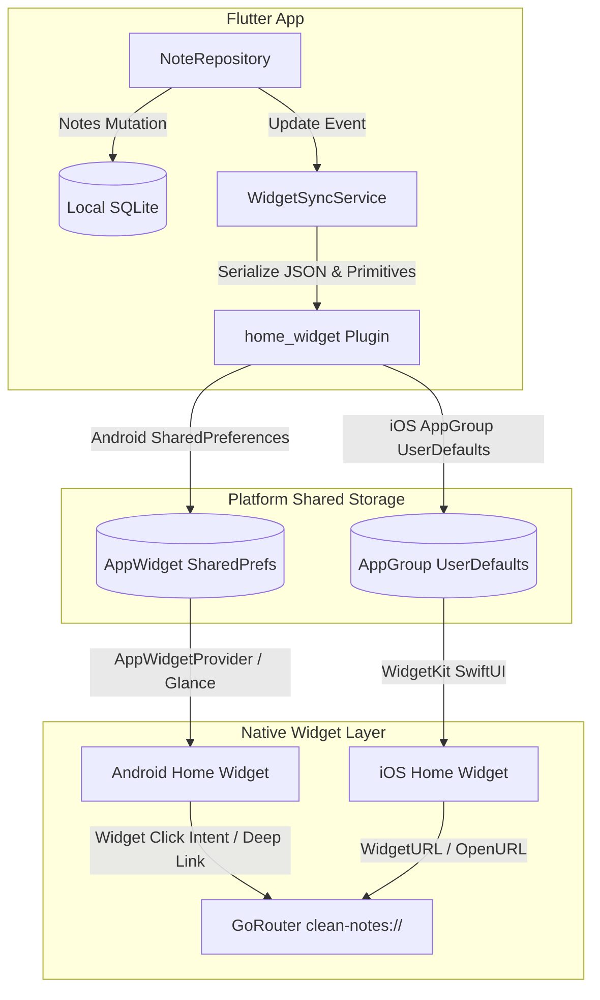

# Flutter Clean Notes — Home Screen Widgets Specification

| Metadata | Value |
| --- | --- |
| Date | 2026-09-11 |
| Status | Proposed design contract |
| Canonical role | Product and technical specification for Home Screen Widgets on Android and iOS |
| Scope | Phase 1 of Product Roadmap (`docs/roadmap.md`) |

---

## 1. Objective

Provide users with instant access to their notes directly from their device home screen (Android AppWidget & iOS WidgetKit):
1. **Quick Capture Bar (4x1 / 2x2)**: 1-tap shortcuts to create a note, search notes, or open the app.
2. **Pinned Note & Checklist Widget (4x2 / 4x4)**: Display a pinned note or interactive checklist on the home screen, allowing checklist toggles and direct navigation into the note editor.

The app remains strictly **local-first**: all widget data is synchronized through on-device shared storage (`AppGroup` on iOS, `SharedPreferences` on Android) populated by the local SQLite database.

---

## 2. User Experience & Design Specification

### 2.1. Widget Types & Sizing

#### A. Quick Capture Bar (`QuickActionsWidget`)
- **Grid Size**:
  - Android: `4x1` (resizable down to `3x1` or up to `5x1`).
  - iOS: `accessoryRectangular` (Lock Screen) and `systemMedium` (Home Screen).
- **Controls**:
  - 📝 **Tạo ghi chú (New Note)**: Launches the app directly to `/editor` with a clean draft.
  - 🔍 **Tìm kiếm (Search)**: Launches the app directly to `/search` with search bar focused.
  - ⭐ **Ghi chú đã ghim (Pinned Notes)**: Launches the app directly to Home filtered by pinned notes.
- **Visual Design**:
  - Aurora Glass aesthetic: Translucent pill container, subtle border outline, icon + label aligned to Aurora palette.
  - Adapts to system Light/Dark theme automatically.

#### B. Pinned Note / Checklist Widget (`PinnedNoteWidget`)
- **Grid Size**:
  - Android: `4x2`, `4x3`, `4x4`.
  - iOS: `systemSmall`, `systemMedium`, `systemLarge`.
- **Content**:
  - Header: Note title, color accent pill, and last updated time.
  - Body:
    - If plain/markdown text: first 3–6 lines of text preview.
    - If checklist (`- [ ]` / `- [x]`): interactive list of items with checkboxes.
  - Interactive Action (Android 12+ / iOS 17+):
    - Tapping a checkbox toggles the task state directly on the widget.
    - Tapping the note title/body opens the note in `/editor?id={noteId}`.
- **Empty State**:
  - When no note is pinned: shows a clean card: *"Chưa có ghi chú được ghim. Mở ứng dụng để ghim ghi chú quan trọng!"* with a button *"Mở Clean Notes"*.

---

## 3. Architecture & Data Flow

### 3.1. Deep Linking Scheme
The app registers the custom scheme `clean-notes://`:
- `clean-notes://new`: Open empty editor.
- `clean-notes://search`: Open search page.
- `clean-notes://note?id={noteId}`: Open specific note editor.
- `clean-notes://toggle-check?id={noteId}&index={itemIndex}`: Background callback to toggle checklist item in SQLite and re-render widget.

### 3.2. Data Synchronization Seam
A dedicated service `WidgetSyncService` listens to repository events:
- Whenever a note is added, updated, trashed, deleted, or pinned/unpinned:
  1. Query the currently pinned note with highest priority (or most recently updated).
  2. Extract title, preview content, checklist items, color tag, and note ID.
  3. Write data to `home_widget`:
     - `widget_pinned_id`: string
     - `widget_pinned_title`: string
     - `widget_pinned_content`: string
     - `widget_pinned_checklist`: JSON string `[{"text":"...", "done":false}]`
     - `widget_pinned_color`: int
     - `widget_pinned_updated_at`: string
  4. Trigger `HomeWidget.updateWidget(name: 'QuickActionsWidget')` and `HomeWidget.updateWidget(name: 'PinnedNoteWidget')`.

---

## 4. Platform Implementation Details

### 4.1. Android Implementation
- **Configuration**:
  - Declare AppWidget metadata in `android/app/src/main/res/xml/quick_actions_widget_info.xml` and `pinned_note_widget_info.xml`.
  - Register receiver in `AndroidManifest.xml`.
- **Layouts**:
  - `widget_quick_actions.xml`: LinearLayout with horizontal action buttons using VectorDrawables.
  - `widget_pinned_note.xml`: RemoteViews layout with ListView / StackView for checklist items.
- **Theme Support**:
  - Supports Android `DayNight` theming and dynamic colors on Android 12+.

### 4.2. iOS Implementation
- **Extension**:
  - Create `CleanNotesWidgetExtension` target via Xcode.
  - Configure App Group: `group.com.cleannotes.app`.
- **Views**:
  - `QuickActionsWidget.swift`: SwiftUI layout with `Link` and `WidgetURL`.
  - `PinnedNoteWidget.swift`: SwiftUI view displaying note content and interactive `Button(intent: ...)` on iOS 17+.

---

## 5. Non-Goals

- Cloud synchronization between devices (widgets reflect local SQLite state only).
- Rich rich-text / markdown rendering inside the widget (widgets render plaintext preview; full markdown renders inside app).
- Editing full note body directly on the home screen (only toggling checkboxes is interactive; full editing happens in the app editor).

---

## 6. Verification & Quality Gates

1. **Unit & Widget Tests**:
   - `test/features/widgets/widget_sync_service_test.dart`: Test JSON serialization, fallback on empty notes, and priority selection of pinned notes.
   - `test/app/widget_deep_link_test.dart`: Test route parsing for `clean-notes://new`, `clean-notes://search`, and `clean-notes://note?id=...`.
2. **Visual QA & Physical Device Screenshots**:
   - Capture home screen screenshots on target physical devices (Android & iOS simulator) showing:
     - Quick Capture Bar in Light & Dark modes.
     - Pinned Note Widget with active checklist.
     - Empty state widget.
   - Verify that tapping widget shortcuts opens the correct screens within 1 second.
