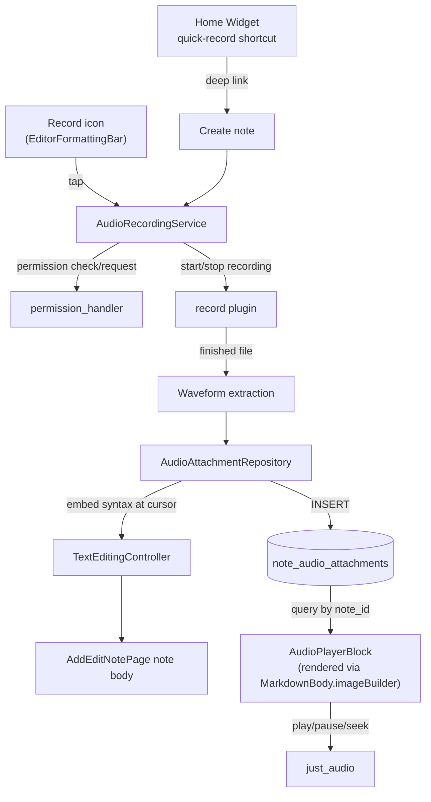

# Flutter Clean Notes — Audio Memo Recording & Playback (Phase 2B-i) Specification

| Metadata | Value |
| --- | --- |
| Date | 2026-09-26 |
| Status | Proposed design contract |
| Canonical role | Product and technical specification for audio memo recording and in-note playback |
| Scope | Phase 2 of Product Roadmap (`docs/roadmap.md`), Part 2B, items 1-2 only — audio recording, storage, and playback. On-device Whisper transcription (Phase 2B-ii) is a separate, later sub-project and is not designed by this document. AI Quick Summary has been removed from the roadmap entirely (no AI/LLM API available for this project) and is out of scope permanently, not just deferred. |

---

## 1. Objective

Let a user attach one or more high-quality voice recordings to a note, played back in place with a waveform and standard player controls — for capturing a thought as raw audio (tone, inflection, exact wording) rather than transcribed text, complementing Phase 2A's realtime dictation rather than replacing it.

Two entry points, both in scope for this phase (decided explicitly, not the smaller default):
- **In-note recording**: a record control in the existing `EditorFormattingBar`, next to the Phase 2A dictation mic.
- **Home Screen Widget quick-record shortcut**: the "🎙️ Ghi âm tức thì" Quick Capture Widget shortcut documented in Phase 1's roadmap section but never implemented — this phase implements it: tapping it creates a new note and immediately starts recording into it.

---

## 2. User Experience

### 2.1 Starting a recording (in-note)

- A new record control sits in `EditorFormattingBar` alongside the existing formatting icons and the Phase 2A dictation mic, following `_iconControl`'s existing visual convention.
- **Tap to start**: requests microphone permission the first time (same `permissionDenied`/`permissionPermanentlyDenied` UX pattern Phase 2A already built — reused, not reinvented: denial stays retriable with a snackbar, permanent denial shows a Settings action). On grant, recording starts immediately; the icon switches to an active/recording state (filled, accent color) and an elapsed-time readout appears next to it.
- The note's cursor position **at the moment recording starts** is captured and remembered — this is where the finished recording's player block will be inserted, regardless of where the cursor drifts to afterward (the user can keep reading/scrolling the note while recording; nothing is live-inserted during the recording itself, unlike Phase 2A's live text).
- **Tap to stop**: ends the recording, computes a waveform from the finished audio file, and inserts a player block into the note body at the remembered cursor position.
- **Recordings under 1 second** (accidental taps) are auto-discarded — no player block is inserted, no permission re-prompt on the next real attempt.

### 2.2 Starting a recording (Home Screen Widget)

- Tapping the widget's quick-record shortcut launches the app, creates a new blank note, opens the editor, and immediately starts recording as if the user had just tapped the in-note record control — same permission flow, same stop/insert behavior. If permission is not available (denied, permanently denied, or the platform doesn't support recording), the note still opens normally with the record control visible in its usual (non-recording) state, so the shortcut never becomes a dead end.
- Technically: this reuses `widget_launch_coordinator.dart`'s existing `clean-notes://new` deep link (already routes to `/note/new`, documented in that file's own comment block alongside `clean-notes://search` and `clean-notes://note?id=...`) with a new distinguishing query param (e.g. `clean-notes://new?action=record`) that `AddEditNotePage` checks on open to auto-trigger the record control's start logic once the page has mounted — no new deep-link scheme, no new native widget-side routing code, only a new Android/iOS home-widget shortcut entry pointing at that URL and one new branch in the existing coordinator/page.

### 2.3 Playback

- The player block shows: a waveform, a play/pause button, elapsed/total duration, a playback-speed control (1x / 1.25x / 1.5x / 2x), and skip ±5s/±10s — matching the roadmap's original feature description exactly.
- Multiple recordings can exist in one note, each its own independent player block, each remembering its own playback position within a session.
- **A recording whose underlying file is missing or unreadable** (moved, deleted outside the app, corrupted) renders the block in an "unavailable" state instead of crashing or silently failing — this reuses the *exact* existing pattern already shipped for a missing Markdown image (`editor.imageUnavailable` / `editor.imageUnavailableAlt` in `add_edit_note_page.dart`'s `MarkdownBody.imageBuilder`), for visual and code consistency.

### 2.4 Deleting a recording

- Each player block has a delete affordance. Deleting removes: the `note_audio_attachments` row, the audio file on disk, and the embed syntax line from the note's Markdown text — all three, atomically from the user's perspective (a failure partway through must not leave an orphaned file *or* an embed pointing at nothing more gracefully than the "unavailable" state above already handles).

### 2.5 Platform scope

- **Android and iOS only**, matching Phase 2A's precedent and this phase's explicit scope decision. On macOS, Windows, web, and Linux, the record control is **disabled from the start** (not shown as tappable-then-failing) — unlike Phase 2A's `unavailable` state, platform support here is a static, compile-time fact (not a runtime one like locale availability), so it is gated the same way, at render time, with no error path to design for it. This deliberately avoids repeating Phase 2A's finding #7 (unsupported platforms reachable through a tappable control that then fails with a misleading error).

### 2.6 Errors

| Condition | Behavior |
| --- | --- |
| Permission denied (first ask or previously denied) | Same as Phase 2A: snackbar, record control stays tappable to retry. |
| Permission permanently denied | Same as Phase 2A: snackbar with a "Settings" action via `openAppSettings()`. |
| Recording fails mid-session (storage full, OS interruption, plugin error) | Stop cleanly, discard the partial file, show an error snackbar, insert nothing — never a broken or partial player block. |
| Playback file missing/unreadable | Player block shows the reused "unavailable" state (§2.3); does not affect other player blocks in the same note. |
| App backgrounded mid-recording | Needs real-device verification (this phase's own manual QA task) before assuming any specific behavior; the design does not assume recording survives backgrounding cleanly on every OS version. |

---

## 3. Architecture & Data Flow



- **`AudioRecordingService`** (new, `lib/features/notes/presentation/services/audio_recording_service.dart`, matching this project's existing `services/` convention — see `DictationService` from Phase 2A for the sibling pattern): thin wrapper around the `record` plugin, behind a `Recorder` interface (mirroring Phase 2A's `SpeechRecognizer`/`PermissionRequester` split) so it is fake-testable without touching platform channels. Owns recording state (`idle`/`recording`/`permissionDenied`/`permissionPermanentlyDenied`/`unavailable`/`error`), exposes `start()`/`stop()` returning the finished file's path and duration, and reuses a `PermissionRequester`-shaped abstraction — **actually reusing Phase 2A's own `PermissionRequester`/`DictationPermissionResult` types directly** (microphone-only request, no speech-recognition permission needed here) rather than duplicating that interface.
- **Waveform extraction**: computed once, after the file is finished recording, from the decoded audio samples (package choice: `just_waveform` or manual PCM decode — confirmed during implementation against whatever the resolved `record`/`just_audio` version's actual API supports, per this project's established "verify against the resolved package version, don't assume" convention from Phase 2A). Stored as a compact numeric array (e.g. downsampled peak amplitudes) in `note_audio_attachments.waveform_data`, not recomputed on every playback.
- **`note_audio_attachments` table** (schema v7 → v8 migration, following `local_note_datasource.dart`'s existing `_schemaVersion`/`onCreate`/`onUpgrade` pattern exactly). `notes.id` is `INTEGER PRIMARY KEY AUTOINCREMENT`, not a UUID/TEXT id (corrected from an earlier draft of this spec) — this table's `noteId` must match that type. Following this codebase's existing convention (`reminder_outbox` references `noteId` with a plain column, no SQL `FOREIGN KEY`/`ON DELETE CASCADE` — this project never enables `PRAGMA foreign_keys`, so a declared FK constraint would be silently unenforced), attachment cleanup on note deletion is handled at the application layer (§3), not by the database:
  ```sql
  CREATE TABLE note_audio_attachments (
    id TEXT PRIMARY KEY,               -- attachment's own id, a UUID (no AUTOINCREMENT
                                        -- collision risk with notes.id, and lets the id be
                                        -- generated before the DB insert, for the embed
                                        -- syntax and any in-flight UI state)
    noteId INTEGER NOT NULL,
    filePath TEXT NOT NULL,
    durationMs INTEGER NOT NULL,
    waveformData TEXT NOT NULL,        -- JSON-encoded numeric array
    createdAt TEXT NOT NULL            -- ISO 8601, matching notes.createdAt's own format
  );
  ```
- **Embed mechanism**: a finished recording is represented in the note's plain-Markdown body as `` — deliberately reusing Markdown's own image syntax rather than inventing a new one, since `flutter_markdown`'s `imageBuilder` callback (already wired in `add_edit_note_page.dart`, currently used only for a real-image "unavailable" placeholder — real image rendering is not implemented) intercepts *all* image syntax uniformly. The existing `imageBuilder` is extended to branch on the URL: an `attachment://` scheme renders the real waveform/player block (looked up from `note_audio_attachments` by id); anything else keeps its current "unavailable" placeholder behavior unchanged. This keeps the note's raw text fully portable Markdown — exporting a note as `.md` still contains a real, if inert outside the app, reference to the attachment; nothing here breaks the "Zero Vendor Lock-in" pillar. Edit mode shows the raw `` line as plain text (same as any other Markdown syntax not specially handled in edit mode today); Preview mode renders the real player.
- **`AudioAttachmentRepository`** (new, data layer, following this project's existing repository-per-concern convention): owns the `note_audio_attachments` CRUD and the embed-syntax insert/remove in the note's text — the single place that keeps the DB row, the file on disk, and the text line in sync for both insertion and deletion.

---

## 4. Non-Goals (explicit)

- On-device Whisper transcription of recordings (Phase 2B-ii — separate spec, later).
- AI-generated summary or title suggestion — removed from the roadmap entirely, not deferred; no AI/LLM API available for this project.
- macOS, Windows, Linux, and web support for recording (record control statically disabled there, §2.5).
- Cloud storage, sync, or sharing of recordings — local-first, matching the rest of this app.
- Editing/trimming a recording after it's made.
- Any change to Phase 2A's dictation feature (a separate, already-shipped control in the same formatting bar).
- Cleaning up orphaned attachment files when a trashed note is auto-purged by `LocalNoteDataSourceImpl.cleanupTrash()`'s existing 30-day sweep. This phase wires attachment cleanup into the direct, user-triggered `NoteRepositoryImpl.deleteNote()` path only (the common case); the trash-sweep path is a known, explicit follow-up (a disk-space leak, not a crash or data-loss risk — the DB rows and files simply outlive the note they referenced until a later cleanup pass).

---

## 5. Testing

- **Unit**: `AudioRecordingService` against a faked `Recorder` interface (mirroring `FakeSpeechRecognizer`'s realism lesson from Phase 2A's independent review — the fake must match the real `record` plugin's actual documented behavior, verified against the resolved package version, not assumed) — start/stop transitions, permission branches (reusing Phase 2A's `DictationPermissionResult`), sub-1-second auto-discard, mid-recording failure handling. `AudioAttachmentRepository` against a real (in-memory or temp-file) SQLite instance — insert/delete keeps DB row, file, and embed text in sync; delete is atomic from the user's perspective even if one step fails.
- **Widget**: the record control's states (idle/recording/permission-denied/permanently-denied/disabled-on-unsupported-platform) with a faked service; the player block's states (normal playback, unavailable-file) with a faked repository/file-existence check — no real audio decoding in widget tests.
- **Manual/visual QA** (per this project's pre-release rule, `docs/qa.md`): real permission prompts, real recording, and real playback cannot be meaningfully faked in CI. A real-device/simulator pass is required before shipping, with the same caveat Phase 2A's QA discovered — the iOS Simulator's CoreAudio has a known limitation that can prevent real audio I/O from working at all (see `docs/agents/session-handoff-2026-09-26.md`, Part 2, item #15); this phase's manual QA task should attempt a real device first if available, and treat a simulator-only pass as incomplete for the recording/playback path specifically (the permission-flow and error-state UI can still be verified on a simulator the same way Phase 2A's was).

---

*This spec covers Phase 2B-i only (recording + playback). Phase 2B-ii (on-device Whisper transcription of these recordings) is a separate, later sub-project and needs its own spec when picked up.*
