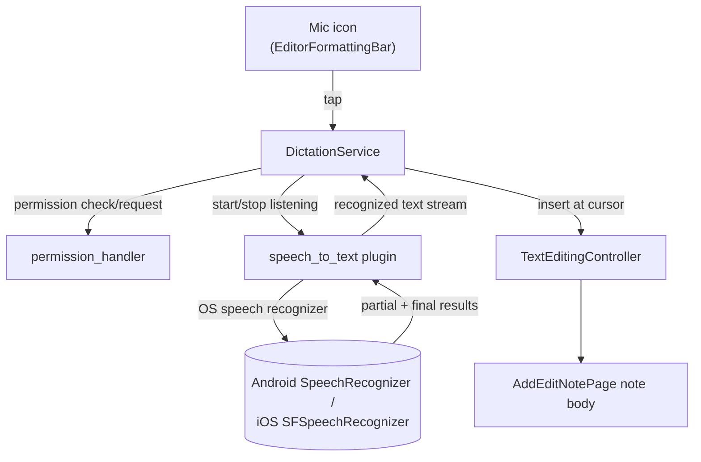

# Flutter Clean Notes — Realtime Dictation (Phase 2A) Specification

| Metadata | Value |
| --- | --- |
| Date | 2026-09-26 |
| Status | Proposed design contract |
| Canonical role | Product and technical specification for realtime speech-to-text dictation in the note editor |
| Scope | Phase 2 of Product Roadmap (`docs/roadmap.md`), Part A only — realtime dictation. Audio-attachment recording/playback, on-device Whisper transcription, and AI quick-summary are explicitly **out of scope** here; they were split into a separate sub-project (Phase 2B) and are not designed by this document. |

---

## 1. Objective

Let a user dictate note text by voice instead of typing, for situations where typing is inconvenient (driving, walking, in a meeting): *"Nói đến đâu văn bản hiển thị đến đó vào thân ghi chú"* (as they speak, text appears live in the note body).

This is intentionally the smallest independently-shippable slice of the roadmap's Phase 2 vision — no audio files are recorded or stored, no on-device Whisper model, no AI summary. It reuses the device OS's built-in speech recognition only.

---

## 2. User Experience

- A new microphone icon control is added to the existing `EditorFormattingBar` (alongside Bold/Italic/Strikethrough/Code), following that widget's existing `_iconControl` pattern exactly — same visual language, no new toolbar or floating button.
- **Tap to start**: requests microphone (and, on iOS, speech-recognition) permission the first time; on grant, begins listening. The mic icon shows an active/listening state (e.g. filled + accent color, matching how other toggled editor controls indicate state).
- While listening, partial and final recognized text is inserted into the note's `TextEditingController` at the current cursor position, updating live as the user speaks (not just once at the end).
- **Tap to stop**: ends the listening session. The package's own OS-level silence/timeout also ends a session automatically; the icon reflects the returned-to-idle state either way.
- **Language**: matches the app's current UI locale (`vi` or `en`, from `easy_localization`'s `context.locale`) — no separate language picker. If the OS lacks a speech recognition model for that locale, dictation is unavailable and the mic icon is disabled with a tooltip/snackbar explaining why (this can genuinely happen for `vi` on some older Android OEM builds).
- **Errors** (permission denied, recognizer unavailable, mid-session failure): show a snackbar with a clear message; typing by hand is never blocked or affected. Dictation is strictly additive to the existing editor, never a required or exclusive input mode.
- **Known limitation, stated up front**: automatic punctuation depends entirely on the OS's speech recognizer and is best-effort — it is not perfect, not customizable, and this feature does not attempt to build a punctuation engine on top of it. Roadmap's "nhận diện dấu câu cơ bản" is satisfied at whatever quality the platform API provides, not guaranteed beyond that.

---

## 3. Architecture & Data Flow

No new domain entities, no new database table/migration, no new repository. This is purely a presentation-layer input mechanism that writes into the same `TextEditingController` normal typing already uses inside `AddEditNotePage`.

- **`DictationService`** (new, `lib/features/notes/presentation/services/dictation_service.dart`, matching the existing `services/` naming convention alongside `note_reminder_gateway.dart` etc.): thin wrapper around the `speech_to_text` plugin. Owns listening state (idle / listening / unavailable), exposes a `Stream<String>` of recognized-text updates and start()/stop()/isAvailable() methods. Doing the OS-plugin wrapping here (not directly in the widget) keeps `EditorFormattingBar` simple and makes the service unit-testable with a fake, matching how `NoteReminderGateway` isolates the notification plugin from the presentation layer elsewhere in this codebase.
- **`EditorFormattingBar`**: gains a `DictationService` (or a controller/provider wrapping one) as a new optional dependency, a mic `_iconControl`, and a listener that appends incoming recognized text into `controller` at the current selection — mirroring how the existing format buttons already mutate the same controller.
- **Permissions**: `permission_handler` package (not yet a dependency — needs adding) requests `Permission.microphone` (both platforms) and `Permission.speech` (iOS only, backing `NSSpeechRecognitionUsageDescription`). Both must be declared:
  - iOS `Info.plist`: `NSMicrophoneUsageDescription`, `NSSpeechRecognitionUsageDescription` — neither exists yet.
  - Android `AndroidManifest.xml`: `RECORD_AUDIO` — does not exist yet.

---

## 4. Error Handling

| Condition | Behavior |
| --- | --- |
| Permission denied (first ask or previously denied) | Snackbar explaining dictation needs mic access; mic icon stays idle/tappable to retry (re-requesting on some platforms, or a "check Settings" hint if permanently denied). |
| Locale has no on-device recognizer | Mic icon disabled (not hidden — still discoverable), tooltip/snackbar states why. |
| Recognizer error mid-session (e.g. network blip on platforms that need it, OS-level failure) | Session ends, snackbar shown, whatever text was already inserted stays — never rolled back. |
| User backgrounds the app while listening | Session ends via the OS lifecycle the same way any other mic-using plugin would; no special handling beyond `DictationService` observing `AppLifecycleState` if the plugin doesn't already do this itself (verify plugin behavior during implementation before adding redundant handling). |

---

## 5. Testing

- **Unit**: `DictationService` against a faked `speech_to_text` plugin interface — start/stop transitions, error propagation, the recognized-text stream.
- **Widget**: `EditorFormattingBar` with a fake `DictationService` — mic icon reflects idle/listening/disabled states correctly; incoming stream events land in the controller at the right position.
- **Manual/visual QA** (per this project's pre-release rule): real permission prompts and actual speech recognition can't be meaningfully faked in CI — a real-device pass (both platforms, both locales) is required before shipping, with screenshots of the mic states, per `docs/qa.md`.

---

## 6. Non-Goals (explicit, matches Phase 2A scope decision)

- No audio recording, storage, or playback (Phase 2B).
- No on-device Whisper transcription of pre-recorded files (Phase 2B).
- No AI-generated summary or title suggestion (Phase 2B — also explicitly deferred by the user pending an available AI/LLM API for this project).
- No custom punctuation model or post-processing of recognizer output.
- No language picker UI — locale is inherited from the app's existing i18n setting.

---

*This spec covers Phase 2A only. Phase 2B (audio memo: recording, waveform playback, Whisper, AI summary) is a separate, larger sub-project and needs its own spec when picked up.*
